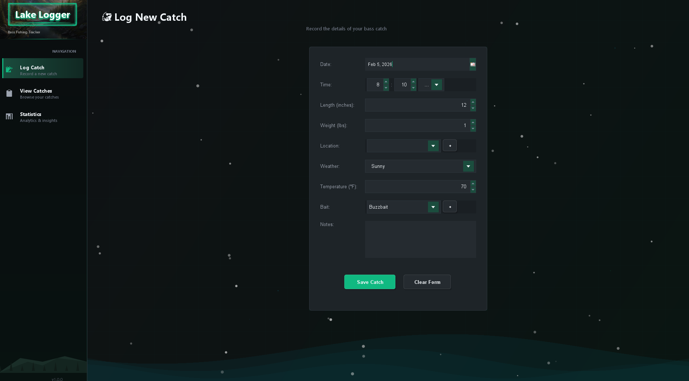
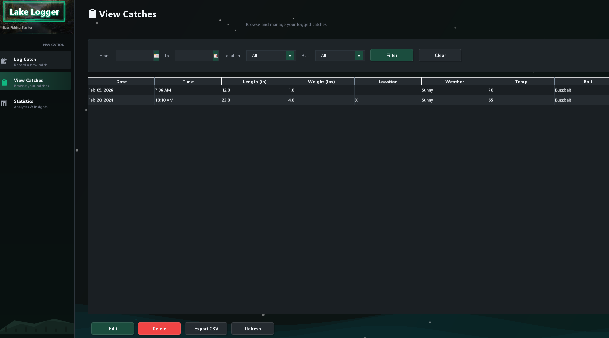
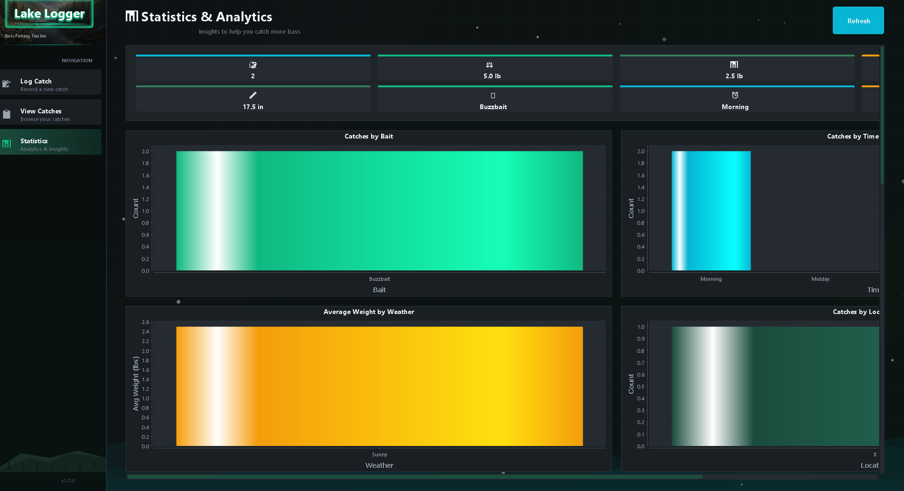

# 🎣 Lake Logger

A sleek, dark-themed desktop application for bass fishing enthusiasts to log catches, track patterns, and analyze fishing data.


## ✨ Features

### 📝 Log Catches
- 📅 Date and time of catch
- ⚖️ Bass weight (lbs) and length (inches)
- 📍 Location (custom, saved for reuse)
- 🌤️ Weather conditions and temperature
- 🪱 Bait/lure used (custom, saved for reuse)
- 📓 Personal notes

### 📋 View & Manage
- 🔀 Sortable data table with all catches
- 🔍 Filter by date range, location, or bait
- ✏️ Edit or delete entries
- 📤 Export to CSV for external analysis

### 📊 Analytics Dashboard
- **Summary Stats**: Total catches, weights, averages, personal bests 🏆
- **Bait Analysis**: Which baits catch the most/biggest fish 🪱
- **Time Patterns**: Best times of day to fish ⏰
- **Weather Insights**: Catch rates by weather conditions 🌦️
- **Location Comparison**: Performance across fishing spots 🗺️

### 🎨 Modern UI
- 🌙 Dark theme with green accents
- ✨ Animated background with floating particles
- 🎯 Custom-styled components (buttons, dropdowns, scrollbars)
- 📏 **UI Scaling** — Ctrl + / Ctrl - to zoom in/out, Ctrl 0 to reset (70%–200%)
- 📱 Responsive layout that adapts to any screen resolution

## 📸 Screenshots

### Log New Catch


### View Catches


### Statistics & Analytics


## 📋 Requirements

- ☕ **Java 17** or later
- 📦 **Maven 3.6+** (for building from source)

## 🚀 Quick Start

### 🪟 Windows

```batch
# Build
scripts\build.bat

# Run
scripts\run.bat
```

### 🍎 macOS / 🐧 Linux

```bash
# Make scripts executable (first time only)
chmod +x scripts/*.sh

# Build
./scripts/build.sh

# Run
./scripts/run.sh
```

### 🔧 Manual Build

```bash
# Build the application
mvn clean package

# Run the application
java --enable-native-access=ALL-UNNAMED -jar target/LakeLogger.jar
```

## 📁 Project Structure

```
LakeLogger/
├── src/main/java/com/lakelogger/
│   ├── LakeLoggerApp.java          # Application entry point
│   ├── model/                       # Data models
│   │   ├── CatchEntry.java         # Catch record
│   │   ├── Location.java           # Fishing location
│   │   └── Bait.java               # Bait/lure type
│   ├── dao/                         # Database layer
│   │   ├── DatabaseManager.java    # SQLite connection
│   │   └── CatchDAO.java           # CRUD operations
│   ├── service/                     # Business logic
│   │   └── AnalyticsService.java   # Statistics calculations
│   ├── ui/                          # User interface
│   │   ├── MainFrame.java          # Main window
│   │   ├── theme/
│   │   │   └── DarkTheme.java      # UI styling
│   │   └── panels/
│   │       ├── LogCatchPanel.java      # Log new catch
│   │       ├── ViewCatchesPanel.java   # View/manage catches
│   │       └── StatsPanel.java         # Analytics dashboard
│   └── util/
│       └── DateTimeUtil.java       # Date/time helpers
├── res/
│   └── images/                      # App icons and graphics
├── scripts/
│   ├── build.bat                    # Windows build script
│   ├── build.sh                     # Unix build script
│   ├── run.bat                      # Windows run script
│   └── run.sh                       # Unix run script
├── pom.xml                          # Maven configuration
└── README.md
```

## 🗄️ Database

Lake Logger uses SQLite for local data storage. The database file is created automatically at:

| Platform | Location |
|----------|----------|
| 🪟 Windows  | `%USERPROFILE%\.lakelogger\lakelogger.db` |
| 🍎 macOS    | `~/.lakelogger/lakelogger.db` |
| 🐧 Linux    | `~/.lakelogger/lakelogger.db` |

### 💾 Backup

To backup your data, simply copy the `lakelogger.db` file to a safe location.

## 🎨 Theme Colors

| Color | Hex | Usage |
|-------|-----|-------|
| 🖤 Background | `#0f1214` | Main background |
| 🃏 Card | `#1e2428` | Panel backgrounds |
| 🌲 Primary | `#1b4d3e` | Forest green accents |
| 💚 Success | `#10b981` | Emerald green highlights |
| 💎 Info | `#06b6d4` | Cyan/water blue |
| 🔶 Warning | `#f59e0b` | Amber accents |
| ❌ Danger | `#ef4444` | Red for delete/errors |
| 📝 Text | `#f0f4f8` | Primary text |

## 📚 Dependencies

| Library | Version | Purpose |
|---------|---------|---------|
| SQLite JDBC | 3.42.0 | Database driver |
| JCalendar | 1.4 | Date picker component |
| JFreeChart | 1.5.4 | Analytics charts |

## ⌨️ Keyboard Shortcuts

| Shortcut | Action |
|----------|--------|
| Ctrl + | Zoom in (increase UI scale) |
| Ctrl - | Zoom out (decrease UI scale) |
| Ctrl 0 | Reset UI scale to 100% |

> UI scale range: 70% – 200%. Scale is applied instantly without restarting the app.

## 🔧 Troubleshooting

### ❓ "Maven not found"
Install Maven from [maven.apache.org](https://maven.apache.org/download.cgi) and add it to your PATH.

### ❓ "Java not found"
Install Java 17+ from [adoptium.net](https://adoptium.net/) and add it to your PATH.

### ⚠️ SQLite warnings on startup
These are harmless warnings from the SQLite driver. The run scripts include `--enable-native-access=ALL-UNNAMED` to suppress them.

### 🗑️ Database location
If you need to reset the app, delete the `.lakelogger` folder in your home directory.

## 🤝 Contributing

1. 🍴 Fork the repository
2. 🌿 Create a feature branch (`git checkout -b feature/amazing-feature`)
3. 💾 Commit your changes (`git commit -m 'Add amazing feature'`)
4. 📤 Push to the branch (`git push origin feature/amazing-feature`)
5. 🔃 Open a Pull Request

## 📄 License

This project is licensed under the MIT License - see the [LICENSE](LICENSE) file for details.

## 🙏 Acknowledgments

- ☕ Built with Java Swing
- 🎨 Icons and graphics designed for outdoor/fishing aesthetic
- 🐟 Inspired by the need to track bass fishing patterns

---

**Happy Fishing!** 🎣🐟🌊
